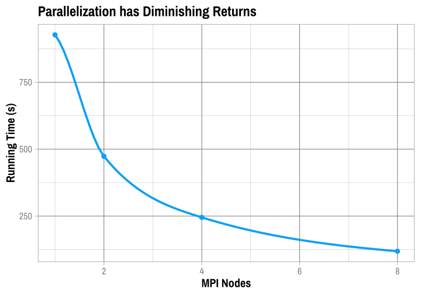

MPI Analysis
================
Adam Shelton

## About the Data

``` r
mpi_data = read_xlsx(here("output_data", "MPI_trials.xlsx"))
mpi_data[1:4, ] %>% ggplot(aes(x = total_nodes, y = proc_secs)) + 
    geom_smooth(color = color_pal(1, "cool"), size = 1.75) + 
    geom_point(color = color_pal(1, "cool"), size = 3.5) + labs(title = "Parallelization has Diminishing Returns", 
    x = "MPI Nodes", y = "Running Time (s)") + theme_master(base_size = 22)
```

<!-- -->
