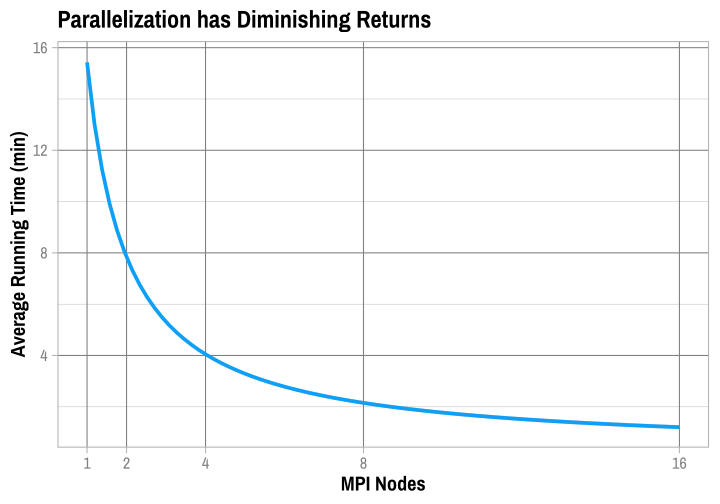
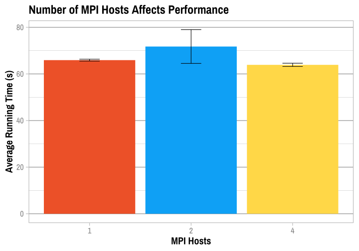

Visualizations
================
Adam Shelton

## MPI Processing

``` r
mpi_data = read_csv(here("output_data", "mpi_trials.csv"))
mpi_data %>% subset(hosts == 1) %>% ggplot(aes(x = nodes, y = proc_time)) + 
    geom_smooth(color = color_pal(1, "cool"), size = 1.75) + 
    labs(title = "Parallelization has Diminishing Returns", x = "MPI Nodes", 
        y = "Running Time (s)") + theme_master(base_size = 22)
```

<!-- -->

``` r
mpi_data %>% na.omit() %>% subset(nodes == 16) %>% ggplot(aes(x = factor(hosts), 
    y = proc_time)) + geom_col(aes(fill = factor(hosts))) + scale_fill_manual(values = color_pal(3)) + 
    labs(title = "Number of MPI Hosts Affects Performance", x = "MPI Hosts", 
        y = "Average Running Time (s)") + theme_master(base_size = 22) + 
    hide_x_gridlines + hide_legend
```

<!-- -->

## Top Tags

``` r
tt_data = read_csv(here("output_data", "top_tags.csv"))
tt_data$count = as.numeric(tt_data$count)
tt_data = tt_data %>% arrange(-count)
tt_data$language = tt_data$language %>% factor()

tt_data %>% .[1:6, ] %>% ggplot(aes(x = reorder(language, -count), 
    y = (count/10^6))) + geom_col(aes(fill = language)) + scale_fill_manual(values = color_pal(6)) + 
    labs(title = "Top Six Tags in StackOverflow Posts", x = "Tag", 
        y = "Number of Posts (in millions)") + theme_master(base_size = 22) + 
    hide_x_gridlines + hide_legend
```

<!-- -->

## Questions by Year

``` r
ques_year_data = read_csv(here("output_data", "top_questions.csv"))
ques_year_data$question = ques_year_data$question %>% str_remove_all("\"") %>% 
    str_remove_all("\\\\") %>% unquote(deep = TRUE) %>% str_trim()
ques_year_data$count[5] = NA

ques_year_data %>% na.omit() %>% ggplot(aes(x = factor(year), 
    y = count)) + geom_col(aes(fill = year)) + scale_fill_gradientn(colors = color_pal(2)) + 
    labs(title = "Top Questions on StackOverflow by Year", x = "Year", 
        y = "Number of ...") + theme_master(base_size = 22) + 
    hide_y_gridlines + hide_legend + coord_flip()
```

<!-- -->

## Two-Grams

``` r
two_grams_data = read_csv(here("output_data", "twograms.csv")) %>% 
    arrange(-count)

bigram_graph <- two_grams_data[1:200, ] %>% graph_from_data_frame()

remove_axes <- theme(axis.text = element_blank(), axis.line = element_blank(), 
    axis.ticks = element_blank(), panel.border = element_blank(), 
    panel.grid = element_blank(), axis.title = element_blank())

ggraph(bigram_graph, layout = "fr") + geom_edge_link(color = "grey") + 
    geom_node_point(color = "grey") + geom_node_text(aes(label = name), 
    nudge_x = 0, nudge_y = 0, repel = TRUE) + labs(title = "Connections Between Tags in StackOverflow Posts") + 
    theme_master(base_size = 22) + remove_axes
```

<!-- -->
